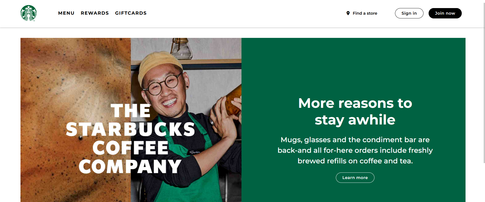

# Starbucks Homepage.

This is a fun side project i decided to code in my spare time. It was a bit challenging but total worth it and it helped me sharpen my skills in a dope way😁.

Kindly take you time to go through the repo and leave a star if you like it.

## `Screenshot`

## Built with

- `Semantic HTML5 Markup`
- `Flexbox`
- `CSS Grid`
- `Responsive design in mind`

 

## Links

- `Live Site URL:` [...](https://comingsoon.com)

